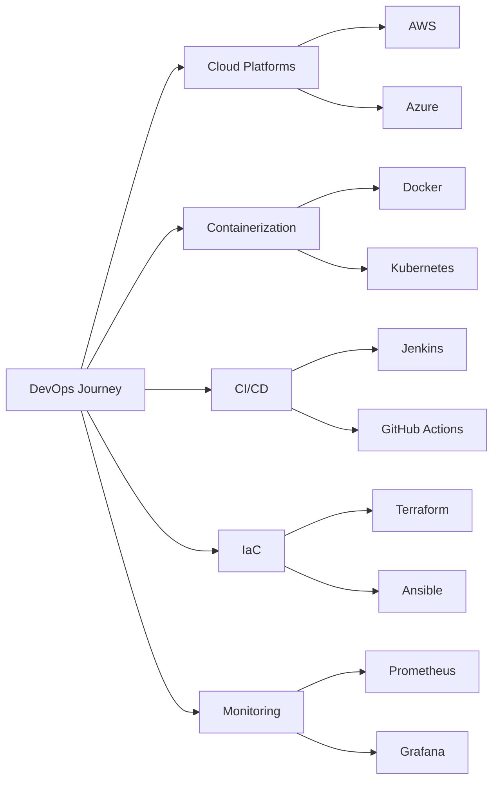

<div align="center">
  
</div>

# <div align="center">👋 Hey there! I'm Bunny</div>

<div align="center">
  
### 🚀 Aspiring DevOps Engineer | Cloud Enthusiast | Automation Advocate

[](https://github.com/Bunny0311)
[](https://github.com/Bunny0311)

</div>


## 🎯 About Me

```yaml
name: Bunny
located_in: India
current_focus: DevOps Engineering
learning: Cloud Technologies, CI/CD, Infrastructure as Code
interests: [Automation, Cloud Computing, Open Source, Problem Solving]
goal: Becoming a skilled DevOps Engineer
```


- 🔭 Currently learning DevOps practices and tools
- 🌱 Building expertise in **CI/CD, Docker, Kubernetes, Cloud Platforms**
- 💼 Open to **internships and entry-level DevOps positions**
- 🎓 Continuously improving through hands-on projects
- 💡 Passionate about automation and infrastructure optimization
- 🤝 Looking to collaborate on **DevOps and Cloud projects**
- 📫 Reach me at: **vrkoushik2005@gmail.com**


## 🛠️ DevOps Tech Stack

<div align="center">

### ☁️ Cloud Platforms


### 🐳 Containerization & Orchestration


### 🔄 CI/CD Tools


### 📜 Infrastructure as Code


### 📊 Monitoring & Logging


### 💻 Version Control & Collaboration


### 🐧 Operating Systems


### 💾 Databases


### 💬 Scripting & Programming


</div>


## 🎓 Currently Learning

<div align="center">



</div>


## 🔗 Connect With Me

<div align="center">

[](https://www.linkedin.com/in/koushik-vaddi-ranga-b958962a8/)
[](mailto:vrkoushik2005@gmail.com)

</div>


<div align="center">
  
**💬 "The best way to predict the future is to implement it."**

**⭐ From [Bunny0311](https://github.com/Bunny0311) | Keep Learning, Keep Building! 🚀**

 <em><b>I love connecting with different people</b> so if you want to say <b>hi, I'll be happy to meet you!</b> 😊</em>

</div>
